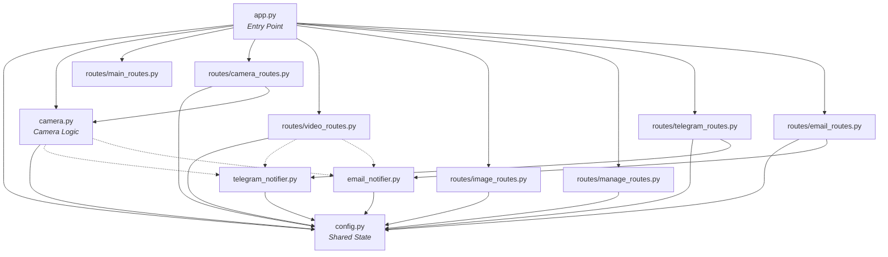

# Demo YOLOv11 — Object Detection

Dự án nhận diện đồ vật bằng YOLOv11 với giao diện web Flask.

## Cấu Trúc Thư Mục

```
Demo_YOLOV11/
│
├── backend/                        # Phần xử lý phía server (Flask)
│   ├── app.py                      # Entry point — khởi tạo Flask app, đăng ký tất cả
│   │                               #   Blueprint. Đây là điểm khởi chạy của ứng dụng.
│   ├── config.py                   # Cấu hình chung — tải YOLO model, khai báo hằng số
│   │                               #   (CONF_THRESHOLD, FRAME_WIDTH, ...), logging, shared state
│   │                               #   (model_lock, video_tasks).
│   ├── camera.py                   # Class CameraStream — quản lý camera stream, xử lý
│   │                               #   capture frame, chạy YOLO inference trên background thread,
│   │                               #   generate MJPEG frames. Chứa trạng thái camera.
│   ├── telegram_notifier.py        # Module gửi cảnh báo phát hiện vật thể qua Telegram Bot
│   │                               #   API (hỗ trợ gửi ảnh kèm bounding boxes và cooldown chống spam).
│   ├── email_notifier.py           # Module gửi cảnh báo phát hiện vật thể qua Gmail sử dụng
│   │                               #   SMTP_SSL (gửi thư kèm ảnh và bảng thống kê kết quả).
│   ├── routes/                     # Thư mục chứa các Blueprint routes
│   │   ├── __init__.py             # Package init
│   │   ├── main_routes.py          # 2 routes: / (trang chủ), /health (health check)
│   │   ├── camera_routes.py        # 5 routes: /video_feed, /api/live_status,
│   │   │                           #   /update_camera, /api/stop_camera, /api/toggle_live_scan
│   │   ├── video_routes.py         # 6 routes: /api/upload_video, /api/scan_existing_video,
│   │   │                           #   /api/stop_scan/<task_id>, /scan_video_feed/<task_id>,
│   │   │                           #   /api/status/<task_id>, /api/check_dir
│   │   ├── image_routes.py         # 1 route: /api/scan_image (nhận diện trên ảnh)
│   │   ├── telegram_routes.py      # 3 routes: quản lý cấu hình và test kết nối Telegram bot
│   │   ├── email_routes.py         # 3 routes: quản lý cấu hình và test kết nối Gmail qua SMTP
│   │   └── manage_routes.py        # 3 routes: /api/videos, /api/videos/<filename>,
│   │                               #   /uploads/<filename> (quản lý video đã upload)
│   └── uploads/                    # Thư mục lưu trữ tự động các file do người dùng tải lên
│                                   #   (video, ảnh) và kết quả nhận diện (ảnh annotated,
│                                   #   file thống kê thong_ke_so_luong.txt).
│
├── frontend/                       # Phần giao diện người dùng (client-side)
│   ├── templates/                  # Chứa các template HTML (Jinja2)
│   │   └── index.html              # Trang giao diện chính — Dashboard với 4 tab:
│   │                               #   1) Camera Trực Tiếp: stream webcam real-time
│   │                               #   2) Quét Video File: upload & phân tích video
│   │                               #   3) Quét Hình Ảnh: upload & nhận diện trên ảnh
│   │                               #   4) Quản lý Video: xem lại kết quả đã xử lý
│   └── static/                     # Tài nguyên tĩnh (CSS, JS)
│       ├── css/
│       │   └── style.css           # File định kiểu giao diện — thiết kế Premium Dark Mode
│       │                           #   với glassmorphism, gradient, animation, responsive layout.
│       │                           #   Định nghĩa toàn bộ design system (biến màu, typography,
│       │                           #   component styles).
│       └── js/
│           └── main.js             # Logic JavaScript phía client — xử lý chuyển tab,
│                                   #   gọi API backend (bật/tắt camera, upload video/ảnh,
│                                   #   stream kết quả nhận diện), cập nhật bảng thống kê
│                                   #   real-time, quản lý danh sách video đã xử lý.
│
├── dataset/                        # Bộ dữ liệu huấn luyện mô hình YOLOv11
│   ├── dataset.yaml                # File cấu hình dataset cho YOLO — khai báo đường dẫn
│   │                               #   đến tập train/val/test, số lượng class (nc: 12),
│   │                               #   và tên của từng class nhận diện.
│   ├── train/                      # Dữ liệu huấn luyện (training set)
│   │   ├── images/                 # Ảnh gốc dùng để train model
│   │   └── labels/                 # File nhãn YOLO (.txt) tương ứng với từng ảnh,
│   │                               #   mỗi dòng chứa: class_id x_center y_center width height
│   ├── val/                        # Dữ liệu đánh giá (validation set)
│   │   ├── images/                 # Ảnh dùng để đánh giá model trong quá trình train
│   │   └── labels/                 # File nhãn tương ứng
│   └── test/                       # Dữ liệu kiểm thử (test set)
│       ├── images/                 # Ảnh dùng để kiểm thử model sau khi train xong
│       └── labels/                 # File nhãn tương ứng
│
├── models/                         # Chứa file model đã huấn luyện
│   └── best_Day_du.pt              # File trọng số (weights) mô hình YOLOv11 đã train —
│                                   #   đây là model tốt nhất được chọn sau quá trình huấn luyện,
│                                   #   nhận diện 12 lớp đồ vật. (~5.2 MB)
│
├── .venv/                          # Môi trường ảo Python (virtual environment) —
│   │                               #   cô lập thư viện riêng cho dự án, tránh xung đột
│   │                               #   với các package hệ thống. Python 3.14.6.
│   │
│   ├── pyvenv.cfg                  # File cấu hình môi trường ảo — lưu phiên bản Python
│   │                               #   (3.14.6), đường dẫn Python gốc, và lệnh tạo venv.
│   │
│   ├── Scripts/                    # Các file thực thi và script kích hoạt venv (Windows)
│   │   ├── activate                # Script kích hoạt venv cho Bash (Git Bash, WSL)
│   │   ├── activate.bat            # Script kích hoạt venv cho Command Prompt (cmd)
│   │   ├── Activate.ps1            # Script kích hoạt venv cho PowerShell
│   │   ├── activate.fish           # Script kích hoạt venv cho Fish shell
│   │   ├── deactivate.bat          # Script tắt (hủy kích hoạt) venv cho cmd
│   │   ├── python.exe              # Bản sao Python interpreter dành riêng cho venv
│   │   ├── pythonw.exe             # Python interpreter chạy ẩn (không hiện console)
│   │   ├── pip.exe                 # Trình quản lý gói pip (cài/gỡ thư viện)
│   │   ├── pip3.exe                # Alias pip cho Python 3
│   │   └── pip3.14.exe             # Alias pip gắn với phiên bản Python 3.14
│   │
│   ├── Include/                    # Thư mục chứa header files C/C++ — dùng khi biên dịch
│   │                               #   các package có extension viết bằng C (hiện đang trống).
│   │
│   ├── Lib/                        # Thư viện Python của môi trường ảo
│   │   └── site-packages/          # Nơi lưu tất cả package đã cài đặt qua pip
│   │       ├── pip/                # Package pip (trình quản lý gói) — cài sẵn khi tạo venv
│   │       │                       #   Dùng để cài đặt các thư viện từ requirements.txt.
│   │       └── pip-26.1.2.dist-info/  # Metadata của pip (phiên bản 26.1.2) — chứa thông tin
│   │                               #   bản quyền, phiên bản, danh sách file đã cài.
│   │                               #   ⚠️ Lưu ý: Các thư viện dự án (flask, ultralytics,
│   │                               #   opencv-python, numpy, werkzeug) sẽ được cài vào đây
│   │                               #   sau khi chạy: pip install -r requirements.txt
│   │
│   └── .gitignore                  # File cấu hình Git — đánh dấu bỏ qua toàn bộ .venv
│                                   #   khi commit lên repository (không push thư viện lên Git).
│
├── requirements.txt                # Danh sách thư viện Python cần thiết —
│                                   #   flask, ultralytics, opencv-python, numpy, werkzeug.
│                                   #   Cài đặt bằng: pip install -r requirements.txt
│
└── README.md                       # Tài liệu hướng dẫn dự án (file này) —
                                    #   mô tả cấu trúc, cách cài đặt, cách chạy,
                                    #   và thông tin về model/dataset.
```

## Sơ Đồ Phụ Thuộc (Dependency Graph)

Sơ đồ dưới đây thể hiện **file nào import (sử dụng) file nào** trong phần backend.
Mũi tên từ A → B có nghĩa: *"File A phụ thuộc vào (import) file B"*.



### Giải thích sơ đồ

**Tầng 1 — `app.py` (điểm khởi chạy, trên cùng):**

| Mũi tên | Ý nghĩa |
|---------|----------|
| `app.py` → `config.py` | Import logger, cấu hình chung |
| `app.py` → `camera.py` | Import để đăng ký atexit handler (giải phóng camera khi tắt) |
| `app.py` → 7 file `routes/*` | Import 7 Blueprint để đăng ký vào Flask app |

**Tầng 2 — Các file routes và modules logic (giữa):**

| Mũi tên | Ý nghĩa |
|---------|----------|
| `camera_routes.py` → `camera.py` | Dùng CameraStream, camera_stream, live_yolo_active... |
| `camera_routes.py` → `config.py` | Dùng model, logger |
| `video_routes.py` → `config.py` | Dùng model, model_lock, video_tasks, UPLOAD_FOLDER... |
| `image_routes.py` → `config.py` | Dùng model, model_lock, CONF_THRESHOLD, logger |
| `manage_routes.py` → `config.py` | Dùng UPLOAD_FOLDER |
| `telegram_routes.py` → `config.py` | Dùng logger |
| `telegram_routes.py` → `telegram_notifier.py` | Lưu cấu hình của Telegram Bot, thực hiện test gửi thử |
| `telegram_notifier.py` → `config.py` | Sử dụng logger |
| `email_routes.py` → `config.py` | Dùng logger |
| `email_routes.py` → `email_notifier.py` | Lưu cấu hình Gmail, thực hiện test gửi thử |
| `email_notifier.py` → `config.py` | Sử dụng logger |
| `camera.py` → `telegram_notifier.py` & `email_notifier.py` | Tự động gọi gửi ảnh cảnh báo khi camera phát hiện vật thể |
| `video_routes.py` → `telegram_notifier.py` & `email_notifier.py` | Tự động gọi gửi ảnh thống kê khi quét video hoàn thành |
| `main_routes.py` | Không phụ thuộc file nào trong dự án (chỉ dùng Flask) |

**Tầng 3 — `config.py` (nền tảng, dưới cùng):**
- Không import file nào trong dự án — chỉ dùng thư viện bên ngoài
- Đây là "gốc" của cây phụ thuộc

> **Đặc điểm quan trọng:** Mũi tên chỉ đi **từ trên xuống**, không có vòng tròn (circular import) → đảm bảo ứng dụng khởi động đúng thứ tự và dễ bảo trì.

## Cài Đặt

```bash
pip install -r requirements.txt
```

## Chạy Ứng Dụng

```bash
cd backend
python app.py
```

Sau đó mở trình duyệt tại: http://localhost:5000

## Các Lớp Nhận Diện (12 classes)

| ID | Tên |
|----|-----|
| 0 | Nasal spray |
| 1 | Pencil |
| 2 | USB |
| 3 | air conditioner remote |
| 4 | blue mechanical pencil |
| 5 | blue pen |
| 6 | card holder |
| 7 | pen case |
| 8 | pink head red pen |
| 9 | pink white retractable pen |
| 10 | red pen |
| 11 | white body blue pen |

## Model

- File: `models/best_Day_du.pt`
- Framework: YOLOv11 (Ultralytics)
- Confidence threshold: 0.5

## Tính Năng Cảnh Báo Telegram (Telegram Alerts)

Hệ thống hỗ trợ gửi thông báo kèm ảnh chụp nhận diện (chứa bounding box) và bảng thống kê số lượng vật thể trực tiếp đến tài khoản Telegram của bạn khi phát hiện vật thể.

### Hướng dẫn thiết lập Telegram Bot:
1. Mở Telegram, tìm kiếm **@BotFather** và gửi lệnh `/newbot` để tạo bot mới. Copy chuỗi **Bot Token** được cấp.
2. Tìm kiếm **@userinfobot** (hoặc bot lấy ID tương tự), nhấn `/start` để lấy số **Chat ID** của tài khoản bạn.
3. Chạy ứng dụng web, tại tab **Camera Trực Tiếp**:
   - Nhập **Bot Token** và **Chat ID** vào panel **Cảnh báo Telegram** ở sidebar.
   - Nhấn **Lưu cấu hình**.
   - Nhấn nút **Test** để gửi tin nhắn thử nghiệm nhằm xác nhận kết nối hoạt động thành công.

### Cơ chế hoạt động:
- **Tùy chọn đa chế độ:** Bạn có thể tích chọn lưu ảnh cục bộ trên máy, gửi cảnh báo Telegram, hoặc **chọn cả hai cùng lúc** thông qua hai checkbox độc lập trên giao diện.
- **Tính năng Cooldown (Chống Spam):** Khoảng cách thời gian tối thiểu giữa các lần gửi cảnh báo (mặc định là `30` giây, có thể tùy chỉnh trên giao diện) để tránh việc bot gửi tin nhắn liên tục khi vật thể đứng im trước camera.

## Tính Năng Cảnh Báo Email (Email Alerts)

Hệ thống hỗ trợ gửi email cảnh báo kèm ảnh chụp nhận diện (chứa bounding box) và bảng thống kê số lượng vật thể trực tiếp qua hòm thư Gmail của bạn thông qua giao thức SMTP SSL.

### Hướng dẫn thiết lập Gmail gửi cảnh báo:
1. Chuẩn bị tài khoản Gmail người gửi. Để bảo mật, bạn cần tạo **Mật khẩu ứng dụng (App Password)** của Google (thay vì dùng mật khẩu tài khoản chính):
   - Vào cài đặt tài khoản Google của bạn -> Bảo mật (Security).
   - Bật **Xác minh 2 bước (2-Step Verification)** (nếu chưa bật).
   - Chọn mục **Mật khẩu ứng dụng (App Passwords)** ở dưới cùng, tạo một ứng dụng mới (ví dụ đặt tên là `YOLO Vision`).
   - Copy chuỗi mật khẩu gồm 16 ký tự được hiển thị.
2. Chạy ứng dụng web, tại tab **Camera Trực Tiếp**:
   - Nhập **Email người gửi (Sender Email)**, **Mật khẩu ứng dụng** vừa tạo (16 ký tự viết liền không dấu cách), và **Email người nhận (Receiver Email)** vào panel **Cảnh báo Email** ở sidebar.
   - Nhấn **Lưu cấu hình**.
   - Nhấn nút **Test** để gửi email thử nghiệm xác nhận kết nối SMTP hoạt động thành công.

### Cơ chế hoạt động:
- **Tùy chọn gửi email:** Bạn có thể bật/tắt tính năng gửi cảnh báo Email thông qua checkbox tương ứng trên giao diện.
- **Tính năng Cooldown (Chống Spam):** Tương tự như Telegram, bạn có thể thiết lập thời gian giãn cách tối thiểu giữa các lần gửi email (mặc định là `60` giây) để tránh spam hòm thư.
- **Số lượng vật thể tối thiểu:** Cho phép cấu hình số lượng vật thể tối thiểu được phát hiện trước khi kích hoạt gửi email cảnh báo.

